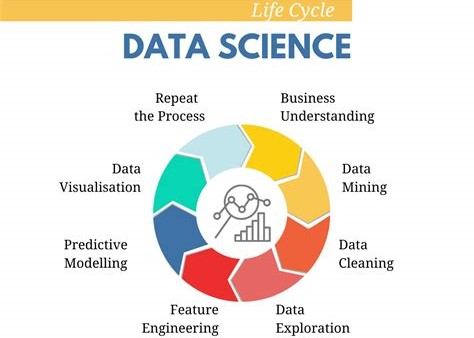

# Репозиторий pet-проектов

## Содержание:
| Номер проекта | Название и ссылка | О чем проект                                                     |
|---------------|-------------------|------------------------------------------------------------------|
|1              |[Парсинг LinkedIn](https://github.com/AlexeyK12/Pet_projects/tree/main/Парсинг%20LinkedIn)|Парсинг вакансий аналитиков в EU|
|2              |[Аналитическая таблица E-commerce](https://github.com/AlexeyK12/Pet_projects/blob/main/Аналитическая%20таблица%20E-commerce/Аналитическая%20таблица%20E-commerce.ipynb)|Создание аналитической таблицы и расчёт основных метрик|
|3              |[Дашборд Power BI Netflix](https://github.com/AlexeyK12/Pet_projects/tree/main/Дашборд%20в%20Power%20BI%20-%20Netflix)|Исследование фильмов и шоу на Netflix|
|4              |[Исследование численности населения мира 1980-2022](https://github.com/AlexeyK12/Pet_projects/blob/main/Исследовательский%20анализ%20населения%20мира%201980-2022/Исследовательский%20анализ%20населения%20мира%201980-2022.ipynb)|Исследовательский проект рассматривающий территорию и численность населения планеты Земля по десятилетиям с 1980 года|
|5              |[Анализ основных метрик компании](https://github.com/AlexeyK12/Pet_projects/blob/main/Метрики%20компании/Расчёт%20и%20визуализация%20основных%20метрик%20компании.ipynb)|Расчёт и визуализация основных показателей компании, аналитика работы менеджеров|
|6              |[Дашборд Power BI E-commerce](https://github.com/AlexeyK12/Pet_projects/tree/main/Дашборд%20Power%20BI%20-%20E-commerce)|Продажи индийского e-commerce сайта|
|7              |[Аналитика Youtube-канала RomanSergeevCom](https://github.com/AlexeyK12/Pet_projects/tree/main/Аналитика%20Youtube-канала%20RomanSergeevCom)|Предобработка, расчет метрик и построение дашборда в Power BI|
|8              |[Анализ изменения цены лечения в медицинской клинике](https://github.com/AlexeyK12/Pet_projects/blob/main/Анализ%20изменения%20цены%20лечения%20в%20медицинской%20клинике/Анализ%20изменения%20цены%20лечения%20в%20медицинской%20клинике.ipynb)|Аналитический проект, исследующий изменение стоимости услуг в медицинской клинике, и проверка гипотез о влиянии ключевых драйверов|
|9              |[Анализ эффективности, и разработка модели принятия решений для страховой компании](https://github.com/AlexeyK12/Pet_projects/blob/main/Анализ%20эффективности%2C%20и%20разработка%20модели%20принятия%20решений/Система%20принятия%20решений%20страховой%20компанией.ipynb)|Исследование эффективности системы определения "зелёных кейсов", и разработка модели машинного обучения для принятия решений страховой компанией| 
|10             |[Обработка звука методом главных компонент](https://github.com/AlexeyK12/PET-projects/blob/main/Обработка%20звука%20методом%20главных%20компонент/Обработка%20звука%20методом%20главных%20компонент.ipynb)|Сжатие аудиодорожки с применением алгоритма PCA (principal component analysis)| 
|11             |[Predicting House Prices using OOP](https://github.com/AlexeyK12/PET-projects/blob/main/Predicting%20House%20Prices%20using%20OOP/Проект_2_ООП.ipynb)|Соревнование Kaggle - прогнозирование цен на дома, с использованием объектно-ориентированного программирования| 
|12             |[Приложение ML в streamlit](https://github.com/AlexeyK12/PET-projects/tree/main/Приложение%20ML%20в%20Streamlit)|Приложение с возможностью подбора гиперпараметров и получения метрик модели для прогнозирования цен на жильё, на основании CatBoost и Streamlit| 
